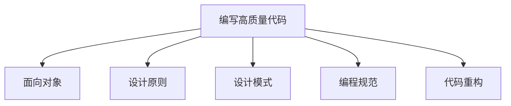

# 设计模式

[TOC]

------

## 导读

### 最常用的代码质量评价标准

1. 可维护性(maintainability)
2. 可读性(readability)
3. 可扩展性(extensibility)
4. 灵活性(flexibility)
5. 简洁性(simplicity)
6. 可复用性(reusability)
7. 可测试性(testability)

### 编写高质量代码的方法论



1. 面向对象
   + 封装、抽象、继承、多态
   + 面向对象编程 VS 面向过程编程
   + 面向对象分析、设计、编程
   + 接口 VS 抽象类
   + 基于接口而非实现编程
   + 多用组合少用继承
   + 贫血模型和充血模型

2. 设计原则

   + SOLID原则——SRP单一职责原则
   + SOLID原则——OCP开闭原则
   + SOLID原则——LSP里氏替换原则
   + SOLID原则——ISP接口隔离原则
   + SOLID原则——DIP依赖倒置原则
   + DRY原则、KISS原则、YAGNI原则、LOD原则

3. 设计模式

   ```mermaid
   graph LR
   	A[设计模式] --> B[创建型]
   	A[设计模式] --> C[结构型]
   	A[设计模式] --> D[行为型]
   	B[创建型] --> E[常用]
   	B[创建型] --> F[不常用]
   	C[结构型] --> G[常用]
   	C[结构型] --> H[不常用]
   	D[行为型] --> I[常用]
   	D[行为型] --> J[不常用]
   	E[常用] --> K[单例模式、工厂模式（工厂方法和抽象工厂）、建造者模式]
   	F[不常用] --> L[原型模式]
   	G[常用] --> M[代理模式、桥接模式、装饰者模式、适配器模式]
   	H[不常用] --> N[门面模式、组合模式、享元模式] 
   	I[常用] --> O[观察者模式、模版模式、策略模式、职责链模式、迭代器模式、状态模式]
   	J[不常用] --> P[访问者模式、备忘录模式、命令模式、解释器模式、中介模式] 
   ```

4. 编程规范

   + 20条最快速改善代码质量的编程规范

5. 代码重构

   + 目的、对象、时机、方法
   + 单元测试和代码的可测试性
   + 大重构（大规模高层次）
   + 小重构（小规模低层次）

------

## 设计原则与思想：面向对象

### 面向对象到底在谈论什么

+ 面向对象编程(Object Oriented Programming)和面向对象编程语言(Object Oriented Programming Language)

+ 如何判定某编程语言是面向对象编程语言

+ 面向对象分析和面向对象设计

  两个阶段产出类的设计：包括程序被拆解为哪些类，每个类有哪些属性和方法，类与类之间如何交互等

+ UML

### 封装、抽象、继承、多态

+ 封装——数据信息隐藏或数据访问保护。类通过有限的访问接口，授权外部仅能通过类提供的方式（或叫函数）来访问内部信息或者数据。

+ 金融系统中简化版的虚拟钱包代码实现

  ```java
  public class Wallet {
      private String id;
      private long createTime;
      private BigDecimal balance;
      private long balanceLastModifiedTime;
      
      public Wallet() {
          this.id = IdGenerator.getInstance().generate();
          this.createTime = System.currentTimeMillis();
          this.balance = BidDecimal.ZERO;
          this.balanceLastModifiedTime = System.currentTimeMillis();
      }
  }
  
  // 注意，下面对get方法做了代码折叠，是为了减少篇幅
  public String getId() { return this.id; }
  public long getCreateTime() { return this.createTime; }
  public BigDecimal getBalance() {return this.balance; }
  public long getBalanceLastModifiedTime() {return this.balanceLastModifiedTime};
  
  public void increaseBalance(BidDecimal increasedAmount) {
      if (increasedAmount.compareTo(BidDecimal.ZERO) < 0) {
          throw new InvalidAmountException("...");
      }
      this.balance.add(increasedAmount);
      this.balanceLastModifiedTime = System.currentTimeMillis();
  }
      
  public void decreaseBalance(BidDecimal decreasedAmount) {
      if (decreasedAmount.compareTo(BidDecimal.ZERO) < 0) {
          throw new InvalidAmountException("...");
      }
      if (decreasedAmount.compareTo(this.balance) > 0) {
          throw new InsufficientAmountException("...");
      }
      this.balance.subtract(decreasedAmount);
      this.balanceLastModifiedTime = System.currentTimeMillis();
  }
  ```

  

## 设计原则与思想：设计原则


## 设计原则与思想：规范与重构


## 设计模式与范式：创建型


## 设计模式与范式：结构型


## 设计模式与范式：行为型


## 开源项目


## 实战项目


